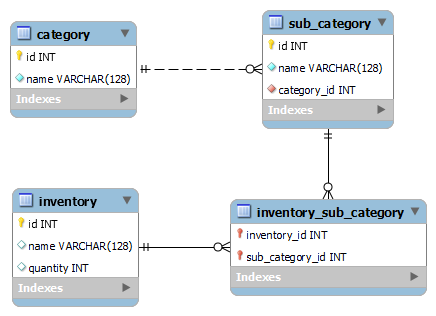

# InventoryCodeChallenge

This is a code challenge project.

## Requirements
The Inventory Application should have the features below.
1. An Inventory has name, category, sub-category, quantity information
2. The system supported to create Inventory, update the quantity and browse the Inventory records
3. There are some validation rules when creating an inventory, eg. a sub-category "Shoe" should not in category "Food", or sub-category "Cake" should not in category "Clothes".
4. Additional features supported which not mention in above will be treated as bonus

## Design

### Assumption
 - Each Sub Category must contain exactly 1 category
 - Each inventory must have at least 1 sub category
 - Quantity cannot be less than 0

### Database Design



### API
All the request & response are done in `json`.

<br/>

#### Response
Response from api in the following format

```json
{"state":"SUCCESS","message":"","data":""}
```
| Name | Description | 
| ---| ---|
|state| the state of the request. Either `SUCCESS` or `ERROR`
|message|Provide the error message if any. Otherwise, empty string.|
|data|The data return from the call. It can be `string`, `list`, or `object`

<br/>

#### Category Endpoint

<table>
    <tr>
        <th>Path</th>
        <th>Description</th>
        <th>Method</th>
        <th>Parameter</th>
        <th>Request</th>
        <th>Response</th>
    </tr>
    <tr>
        <td>/api/v1/category</td>
        <td>Retrieve all existing category</td>
        <td>GET</td>
        <td></td>
        <td></td>
        <td><pre>{
    "state": "SUCCESS",
    "message": "",
    "data": [
        {
            "id": 1,
            "name": "category1"
        }
    ]
}</pre></td>
    </tr>
    <tr>
        <td>/api/v1/category</td>
        <td>insert a new category</td>
        <td>POST</td>
        <td>
            <ul>
                <li>name => name of the category</li>
            </ul>
        </td>
        <td><pre>{
    "name": "Category1"
}</pre></td>
        <td><pre>{
    "state": "SUCCESS",
    "message": "",
    "data": {
        "id": 1,
        "name": "category1"
    }
}</pre></td>
    </tr>
</table>

<br/>

#### Sub-category Endpoint

<table>
    <tr>
        <th>Path</th>
        <th>Description</th>
        <th>Method</th>
        <th>Parameter</th>
        <th>Request</th>
        <th>Response</th>
    </tr>
    <tr>
        <td>/api/v1/subcategory</td>
        <td>Retrieve all existing sub-category</td>
        <td>GET</td>
        <td></td>
        <td></td>
        <td><pre>{
    "state": "SUCCESS",
    "message": "",
    "data": [
        {
            "id": 1,
            "name": "subCategory1",
            "category": {
                "id": 1,
                "name": "Category1"
            }
        }
    ]
}</pre></td>
    </tr>
    <tr>
        <td>
    /api/v1/category/{categoryId}
<br/>
{categoryId} => category ID 
</td>
        <td>insert a new sub-category</td>
        <td>POST</td>
        <td>
            <ul>
                <li>name => name of the sub-category</li>
            </ul>
        </td>
        <td><pre>{
    "name": "sub-category1"
}</pre></td>
        <td><pre>{
    "state": "SUCCESS",
    "message": "",
    "data": {
        "id": 1,
        "name": "sub-category1",
        "category": {
            "id": 1,
            "name": "category1"
        }
    }
}</pre></td>
    </tr>
</table>


<br/>

#### Inventory Endpoint


<table>
    <tr>
        <th>Path</th>
        <th>Description</th>
        <th>Method</th>
        <th>Parameter</th>
        <th>Request</th>
        <th>Response</th>
    </tr>
    <tr>
        <td>/api/v1/inventory</td>
        <td>Retrieve all existing inventory</td>
        <td>GET</td>
        <td></td>
        <td></td>
        <td><pre>{
    "state": "SUCCESS",
    "message": "",
    "data": [
        {
            "id": 1,
            "name": "inventory1",
            "quantity": 99,
            "categories": [
                {
                    "id": 1,
                    "name": "Category1",
                    "subCategories": [
                        {
                            "id": 1,
                            "name": "subCategory1"
                        }
                    ]
                }
            ]
        }
    ]
}</pre></td>
    </tr>
<tr>
        <td>
    /api/v1/inventory/{inventoryId}
<br/>
{inventoryId} => inventory ID 
</td>
        <td>Retrieve inventory with inventory id</td>
        <td>GET</td>
        <td></td>
        <td></td>
        <td><pre>{
    "state": "SUCCESS",
    "message": "",
    "data": {
        "id": 1,
        "name": "inventory1",
        "quantity": 99,
        "categories": [
            {
                "id": 1,
                "name": "Category1",
                "subCategories": [
                    {
                        "id": 1,
                        "name": "subCategory1"
                    }
                ]
            }
        ]
    }
}</pre></td>
    </tr>
    <tr>
        <td>
    /api/v1/inventory/
</td>
        <td>insert a new sub-category</td>
        <td>POST</td>
        <td>
            <ul>
                <li>name => name of the inventory</li>
                <li>quantity => positive integer</li>
                <li>subCategories => array of sub-category integer</li>
            </ul>
        </td>
        <td><pre>{
    "name": "inventory1",
    "quantity": 999,
    "subCategories": [
        1
    ]
}</pre></td>
        <td><pre>{
    "state": "SUCCESS",
    "message": "",
    "data": {
        "id": 1,
        "name": "inventory1",
        "quantity": 999,
        "categories": [
            {
                "id": 1,
                "name": "Category1",
                "subCategories": [
                    {
                        "id": 1,
                        "name": "subCategory1"
                    }
                ]
            }
        ]
    }
}</pre></td>
    </tr>
<tr>
        <td>
    /api/v1/inventory/
</td>
        <td>update existing inventory</td>
        <td>PUT</td>
        <td>
            <ul>
                <li>id => existing inventory id</li>
                <li>quantity => positive integer</li>
            </ul>
        </td>
        <td><pre>{
    "id": 1,
    "quantity": 999
}</pre></td>
        <td><pre>{
    "state": "SUCCESS",
    "message": "",
    "data": {
        "id": 1,
        "name": "inventory1",
        "quantity": 5000,
        "categories": [
            {
                "id": 1,
                "name": "Category1",
                "subCategories": [
                    {
                        "id": 1,
                        "name": "subCategory1"
                    }
                ]
            }
        ]
    }
}</pre></td>
    </tr>
</table>

<br/>


## Build & Deploy

This project only build & tested against `H2` database which is in-memory database.

To start this project, locate the file `inventoryCodeChallenge.StartApplication.java`

The SprintBoot server had been configured to port `80` with context path `/api/v1`. Once the server start it can be accessed by http://localhost/api/v1/category